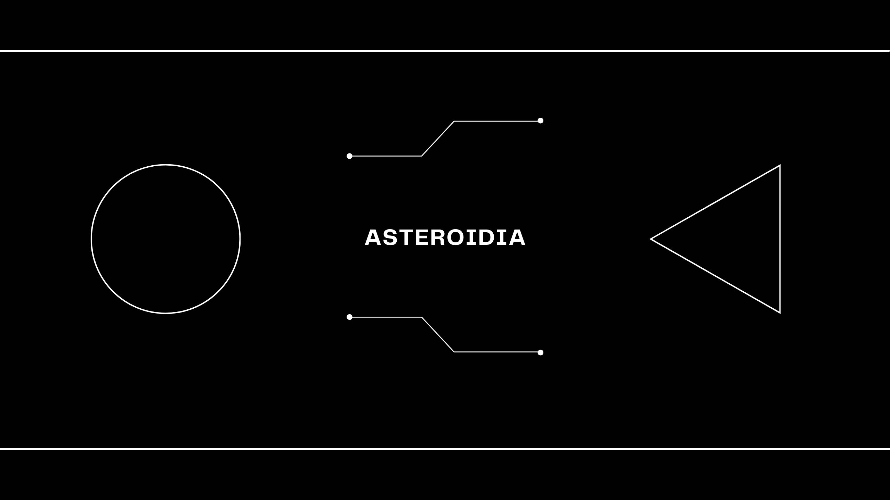

<p align="center">


</p>


# 🚀 Asteroidia – A Simple Pygame Game 

A super simplistic version of Asteroids I made while learing game development with Python and Pygame. I also used this project to learn how to automate building an executable using GitHub Actions, and to integrate security checks using Bandit during both local development and CI pipelines. 

🎯 This project was built as part of my learning journey through this course:

👉 [Boot.dev Build Asteroids with Python and Pygame](https://www.boot.dev/courses/build-asteroids-python)
 
# 🕹️ Controls 

| Move | Key |
| ------ | ------ |
| Move Left | A |
| Move Right | D |
| Move Up | W |
| Move Down | S |
| Shoot | Spacebar |
 
# 🧪 Development Setup 

To run and develop this game locally, follow these steps:

1. Clone the Repository 

```
git clone https://github.com/nayfusaurus/asteroidia.git
cd asteroidia
``` 
 
2. Create and Activate a Virtual Environment 

```
python -m venv venv
```

Activate the virtual environment: 

- On Windows: 

```
venv\Scripts\activate
```

On macOS/Linux: 
```
source venv/bin/activate
```

3. Install Dependencies 

Install regular and build-time dependencies: 

```
pip install -r requirements.txt
pip install -r requirements-build.txt
```

4. Run the Game 

```
python main.py
```
 
 
# 🔐 Security Checks with Bandit 

This project uses Bandit to scan for common security issues in Python code. 

To Run Bandit Locally 

```
bandit -c bandit.yml -r . 
```

Bandit is also integrated into the GitHub Actions pipeline and will automatically run on every push or pull request. 
 
# 🤖 Automation with GitHub Actions 

This project automates the creation of standalone executables using GitHub Actions. Every time you push to main, or open a PR targeting main, the following happens: 

- Code is scanned with Bandit.
- The game is packaged into a executable in each architecture (Windows, Linux, MacOS) file using pyinstaller.
- The executable is uploaded as a GitHub release artifact.

You can view the workflow file at: ```.github/workflows/build-game.yml```
 
# 🛠️ Suggestions & Issues 

If you find bugs, have feature requests, or want to suggest improvements, please open a GitHub issue: 

[Open an Issue](https://github.com/nayfusaurus/asteroids/issues/new)  

Contributions are welcome! 
 
 
# 🎓 What I Learned 

- Basics of game loops, sprites, and collision detection in Pygame.
- How to package a Python script into a standalone executable.
- Setting up automated CI/CD pipelines using GitHub Actions.
- Integrating static code analysis tools like Bandit into the development process.
 
# 🙌 Thanks for checking out my game! 
